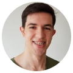

# Introdução

## Guild Capitão \(Definir Nome\)

### Responsabilidades do Capitão

* Gerenciar as Sprints
* +

### Participantes

|  |  |  |  |
| :--- | :--- | :--- | :--- |
|         Vinícius |              Diogo |            Ruan |              Iago |

## Guild SRE \(Definir nome\)

### Responsabilidades do SRE

* Gerenciamento da nuvem
* +

### Participantes

|  |  |  |  |
| :--- | :--- | :--- | :--- |
| Bruno Miguel |            Helena |              Yuri |              Allan |

## Guild Product Owner's / UX - User Experience \(Definir nome\)

### Responsabilidades do PO/UX

* Direção do produto
* +

### Participantes

|  |  |  |  |
| :--- | :--- | :--- | :--- |
|           Victor |            Yan |         Ramon |           Marco |

## Guild Arquitetos de Software / Analistas de Sistemas \(Definir nome\)

### Responsabilidades do Arquiteto/Analista

* Boas práticas do desenvolvimento
* +

### Participantes

|  |  |  |  |
| :--- | :--- | :--- | :--- |
|       Wagner Esser |            Adam |            Julio |           Larissa |
|  |  |  |  |
|     Luiz Gustavo |  Jim | Eber |  |

