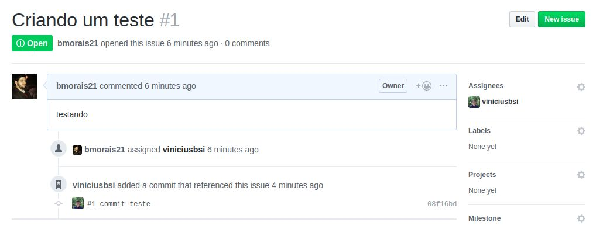
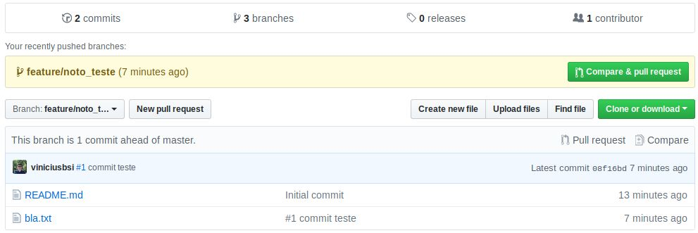
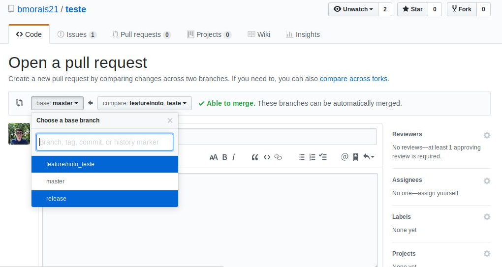
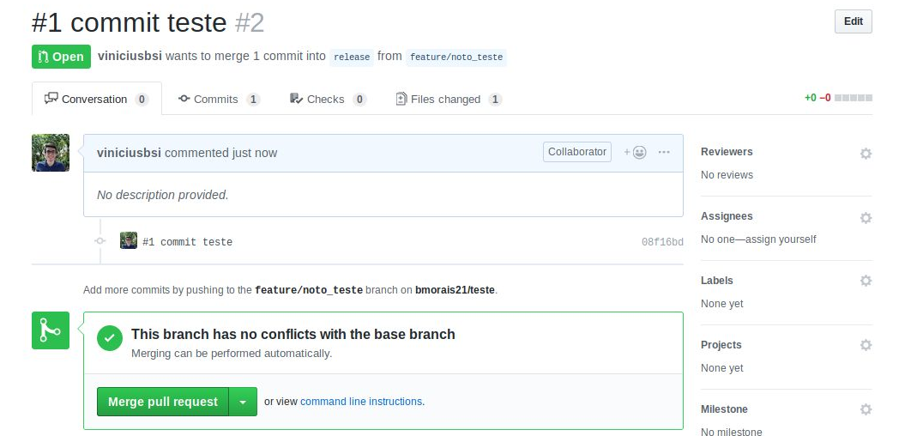
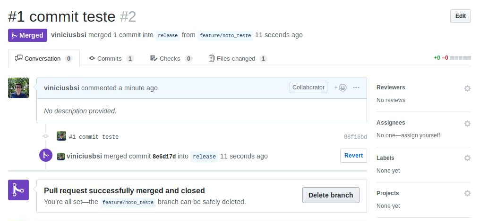

# GitFlow

## Como trabalhar com branches git flow

### Branches

**master:** administrada pelo SRE, é a branch de produção;   
**release:** branch que precede a master, é formado pelo merge das branches de features;   
**feature:** utilizada para commitar as tarefas de uma função do sistema;   
**hotfix:** branch utilizada para correções de bugs.

### Como trabalhar nas branches

Na pasta do projeto **git**, crie a sua branch com a sintaxe nome\_branch/nome\_tarefa. Exemplo:

```text
$git checkout -b feature/nome_feature
```

Os commits nesta branch, iniciarão com o número da issue, para que todos os commits sejam linkados com a issue. 

```text
$git commit -m "#n - descrição" 
```

Para enviar os commits, não esqueça de dar o push com a origin: 

```text
$git push origin feature/nome_feature
```

Na issue, ficará deste jeito: 



### Concluindo a sua tarefa e fazendo pull request

Após as concluir suas tarefas pertencentes aquela branch, será necessário fazer um pull request para a branch **release**. Sua tela inicial do git, será como esta: 



 Clicando em Compare & pull request, irá para tela de pull request \(próxima imagem\), nela você escolherá a branch que irá fazer o pull request \(a da esquerda\) que será a **release**. Após a escolha, descreva o que foi feito e peça o pull request.



Após o procedimento, o pull request será negado ou aceito, no caso se aceito, clique em **merge pull request**. 



Após isso, virá para esta tela, então poderá deletar a branch com o botão **delete branch**. 




