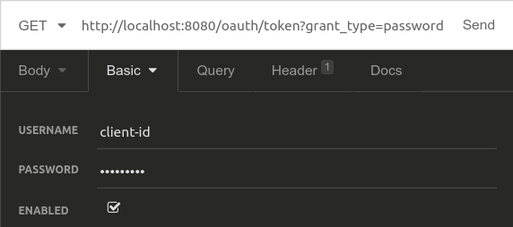
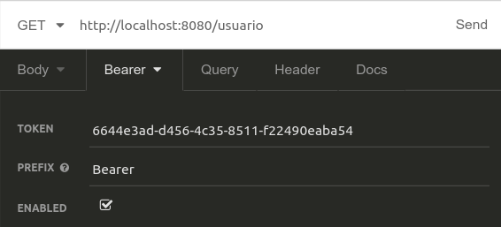
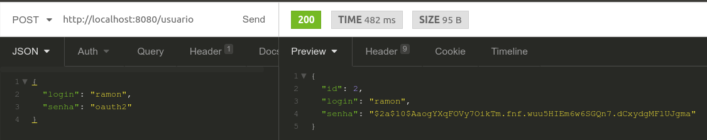
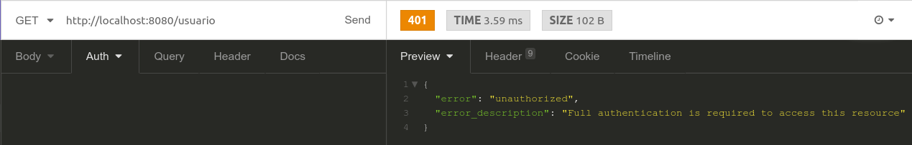
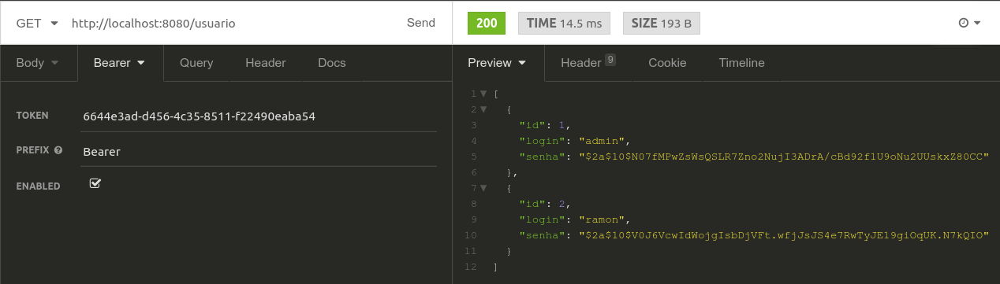

# Autenticação com Spring e OAuth2

Antes de mais nada, vale ressaltar que este não é o único jeito de fazer um sistema de autenticação com Spring. Escolhi fazer um tutorial de autenticação com o OAuth2 porque, na minha opinião, sua documentação e seus tutoriais na internet estavam bem mais claros que o JWT, por exemplo. Como é uma questão de opinião, recomendo que pesquisem também os outros métodos.

Enfim. Inicialmente, crie um projeto Maven ou Gradle com as configurações [deste tutorial](https://academiadev.gitbook.io/joinville/jpa/criando-entidades-jpa-com-h2).

## Estrutura básica

Nosso projeto consiste basicamente de:

* Um pacote `model` contendo uma classe chamada `Usuario.java`, representando a nossa entidade Usuario no banco de dados.
* Um pacote `repository` contendo uma classe chamada `UsuarioRepository.java`, que será responsável por fazer a integração da nossa aplicação com a tabela de Usuarios no banco de dados.
* Um pacote `controller` contendo uma classe chamada `UsuarioController.java`, que é a interface de comunicação da nossa aplicação com o mundo exterior.

Estas três classes estão definidas assim:

```java
package br.com.example.autenticacao.model;

import javax.persistence.Entity;
import javax.persistence.GeneratedValue;
import javax.persistence.Id;

@Entity
public class Usuario {

    @Id
    @GeneratedValue
    private Long id;

    private String login;
    private String senha;

    public Usuario() {}

    public Long getId() {
        return id;
    }

    public void setId(Long id) {
        this.id = id;
    }

    public String getLogin() {
        return login;
    }

    public void setLogin(String login) {
        this.login = login;
    }

    public String getSenha() {
        return senha;
    }

    public void setSenha(String senha) {
        this.senha = senha;
    }
}
```

```java
package br.com.example.autenticacao.repository;  

import br.com.example.autenticacao.model.Usuario;  
import org.springframework.data.jpa.repository.JpaRepository;  
import org.springframework.stereotype.Repository;  

@Repository  
public interface UsuarioRepository extends JpaRepository<Usuario, Long> {  

}
```

```java
package br.com.example.autenticacao.controller;

import br.com.example.autenticacao.model.Usuario;
import br.com.example.autenticacao.repository.UsuarioRepository;
import org.springframework.beans.factory.annotation.Autowired;
import org.springframework.http.HttpStatus;
import org.springframework.http.ResponseEntity;
import org.springframework.web.bind.annotation.*;

import java.util.List;

@RestController
@RequestMapping("usuario")
public class UsuarioController {

    @Autowired
    private UsuarioRepository usuarioRepository;

    @GetMapping
    public List < Usuario > listar() {
        return usuarioRepository.findAll();
    }

    @PostMapping
    public ResponseEntity<?> salvar(@RequestBody Usuario usuario) {
        return ResponseEntity
            .status(HttpStatus.OK)
            .body(usuarioRepository.saveAndFlush(usuario));
    }
}
```

A descrição mais detalhada de como estas anotações funcionam e qual sua utilidade pode ser encontrada [aqui](https://academiadev.gitbook.io/joinville/tutoriais/criando-entidades-jpa-com-h2). Após estas configurações já deve ser possível realizar o cadastro e edição de um usuário pela mensagem POST, além da listagem de todos os usuários com o GET. Porém, imaginemos que alguém só possa listar os usuários se já estiver cadastrada no sistema.

## Iniciando o Spring Security Starter

O Spring já possui algumas ferramentas para a segurança de uma aplicação. Ao simplesmente adicionarmos a linha

`compile('org.springframework.boot:spring-boot-starter-security')`

ao nosso `build.gradle` e iniciarmos a aplicação, ao realizarmos qualquer uma das requisições, teremos a seguinte resposta:

```javascript
{
    "timestamp": "2018-10-29T01:44:21.561+0000",
    "status": 401,
    "error": "Unauthorized",
    "message": "Unauthorized",
    "path": "/usuario"
}
```

Esta mensagem significa que não possuimos autorização para realizar nenhuma das requisições. Porém, como queremos que apenas a requisição de listagem precise de autorização para ser executada, este comportamento está errado.

Precisamos agora colocar mais uma dependência no nosso projeto: `compile('org.springframework.security.oauth:spring-security-oauth2:2.3.4.RELEASE')` Esta biblioteca possui o que nós precisamos para criarmos nosso gerenciador de _tokens_ de segurança.

## Configurando o servidor de autenticação

Aplicações que utilizam OAuth2 geralmente possuem um servidor próprio de autenticação. Nesse nosso caso, vamos configurar a parte de autenticação dentro do nosso próprio projeto.

Para isso, precisamos criar um pacote chamado `config` ou `security` e, dentro dele, uma classe chamada `AuthorizationServerConfig.java`. Precisaremos anotar esse classe com `@Configuration`, que significa que a classe possui _Beans_ de configuração que serão utilizadas em toda a aplicação, e com a anotação `@EnableAuthorizationServer`, que é utilizada para marcar um mecanismo de gerenciamento de autenticação. Além disso, esta deve estender a classe `AuthorizationServerConfigurerAdapter`, utilizada para configurar o servidor de autenticação.

Após isso teremos a seguinte classe:

```java
package br.com.example.autenticacao.config;  

import org.springframework.context.annotation.Configuration;  
import org.springframework.security.oauth2.config.annotation.web.configuration.AuthorizationServerConfigurerAdapter;  
import org.springframework.security.oauth2.config.annotation.web.configuration.EnableAuthorizationServer;  

@Configuration  
@EnableAuthorizationServer  
public class AuthorizationServerConfig extends AuthorizationServerConfigurerAdapter  {  

}
```

Para realizar a configuração do servidor, precisamos sobrescrever três métodos. Todos possuem o nome `configure`, mas cada um recebe um parâmetro diferente:

* `AuthorizationServerSecurityConfigurer` define as configurações de segurança nos endpoints relativos aos _tokens_ de acesso;
* `ClientDetailsServiceConfigurer` define os detalhes para o acesso da aplicação cliente ao servidor de autenticação;
* `AuthorizationServerEndpointsConfigurer`, que define configurações para os endpoints de autenticação e geração de tokens.

O primeiro método deve ficar parecido com isso:

```java
@Override  
public void configure(AuthorizationServerSecurityConfigurer security) throws Exception {  
    security.tokenKeyAccess("permitAll()")  
            .checkTokenAccess("isAuthenticated()")  
            .allowFormAuthenticationForClients();  
}
```

Por padrão, o Spring Security provem dois endpoints relacionados à tokens existentes, que são `/oauth/check_token` e `/oauth/token_key`. Aqui, estamos liberando o acesso à essas requisições.

Agora, precisamos configurar o segundo método:

```java
@Override  
public void configure(ClientDetailsServiceConfigurer clients) throws Exception {  
    clients.inMemory()  
            .withClient("client-id")  
            .secret("secret-id")  
            .authorizedGrantTypes("password", "authorization_code", "refresh_token", "implicit")  
            .scopes("read", "write", "trust")  
            .accessTokenValiditySeconds(ACCESS_TOKEN_VALIDITY_IN_SECONDS)  
            .refreshTokenValiditySeconds(REFRESH_TOKEN_VALIDITY_IN_SECONDS);  
}
```

Com isso estamos dizendo que os _tokens_ ficarão armazenados na memória e estarão disponíveis através do client `client-id` e do secret `secret-id`. Esses dois dados serão importantes na hora de gerarmos os _tokens_. Além disso, estamos dando acesso aos usuários através de `password`, `authorization_code`, `refresh_token` e `implicit`, com os escopos de leitura e/ou escrita. Também foram definidos os tempos que o _token_ de acesso e o _refresh token_ levarão para expirar, em segundos. O _refresh token_ ainda não foi citado, mas ele é utilizado para atualizar o _token_ de segurança de um usuário, gerando um novo _token_ e um novo tempo de expiração.

Por fim, o último método \(desta classe\):

```java
 @Override  
public void configure(AuthorizationServerEndpointsConfigurer endpoints) throws Exception {  
    endpoints.authenticationManager(authenticationManager)  
                .allowedTokenEndpointRequestMethods(HttpMethod.GET, HttpMethod.POST);  
}
```

Neste caso estamos definindo que nossos _tokens_ poderão ser gerados através de requisições GET e POST utilizando o gerenciador _authenticationManager_, que deve ser definido como:

```java
@Autowired  
private AuthenticationManager authenticationManager;
```

Neste momento podemos executar a aplicação e... **erro!** O Spring irá avisar que nesta declaração do `AuthenticationManager`, estamos utilizando a anotação `@Autowired` em um _Bean_ que não está definido. Portanto, iremos criá-lo agora.

Para isso, criaremos no mesmo pacote uma classe chamada `WebSecurityConfigAdapter.java` e colocaremos nela a definição do _Bean_ do gerenciador de autenticação.

```java
package br.com.example.autenticacao.config;

import org.springframework.context.annotation.Bean;
import org.springframework.context.annotation.Configuration;
import org.springframework.security.authentication.AuthenticationManager;
import org.springframework.security.config.annotation.web.configuration.EnableWebSecurity;
import org.springframework.security.config.annotation.web.configuration.WebSecurityConfigurerAdapter;

@Configuration
@EnableWebSecurity
public class WebSecurityConfigAdapter extends WebSecurityConfigurerAdapter {

    @Bean
    public AuthenticationManager customAuthenticationManager() throws Exception {
        return authenticationManagerBean();
    }
}
```

Agora, ao iniciarmos a aplicação, tudo deve ocorrer normalmente. Se observarmos o log da aplicação, devemos encontrar o mapeamento das urls do OAuth2, mas a que nos importa no momento é a `/oauth/token`.

Para realizarmos a geração dos _tokens_, precisaremos do _client-id_ e _secret-id_ definidos acima e do nome de usuário e senha de quem está utilizando a aplicação. Essas duas últimas informações, porém, nós ainda não possuímos.

## Gerenciando usuários

O Spring fornece uma interface chamada `UserDetails.java`, que é utilizada para autenticação com os servidores do OAuth2. Já possuímos uma class de usuário, mas esta ainda não está conectada de nenhuma forma com essa interface.

Criaremos agora, dentro de um pacote `dto`, a classe `UsuarioCustomDTO.java`, que irá implementar a interface `UserDetails`. Neste DTO colocaremos as informações do nosso usuário \(login e senha\). Como estamos implementando a interface, teremos que sobrescrever alguns métodos. A classe ficará da seguinte maneira:

```java
package br.com.example.autenticacao.dto;

import org.springframework.security.core.GrantedAuthority;
import org.springframework.security.core.userdetails.UserDetails;

import java.util.Collection;

public class UsuarioCustomDTO implements UserDetails {

    private String login;
    private String senha;

    @Override
    public Collection<? extends GrantedAuthority> getAuthorities() {
        return null;
    }

    @Override
    public String getPassword() {
        return senha;
    }

    @Override
    public String getUsername() {
        return login;
    }

    @Override
    public boolean isAccountNonExpired() {
        return true;
    }

    @Override
    public boolean isAccountNonLocked() {
        return true;
    }

    @Override
    public boolean isCredentialsNonExpired() {
        return true;
    }

    @Override
    public boolean isEnabled() {
        return true;
    }
}
```

Note que precisamos alterar os métodos `getPassword()` e `getUsername()` para retornarem os dados que nós definimos, além de que todos os outros métodos booleanos deverão ter seu retorno alterado para `true`.

Precisamos agora de uma forma de conectar a nossa entidade Usuario com o UsuarioCustomDTO que acabamos de criar. Para isso, devemos utilizar um construtor da seguinte maneira:

```java
public UsuarioCustomDTO(Usuario usuario) {
    this.login = usuario.getLogin();
    this.senha = usuario.getSenha();
}
```

Precisamos agora fazer com que o usuário que é passado na requisição seja buscado no banco de dados e, a partir do resultado, tenha seu _token_ de acesso gerado. Para isso, podemos adicionar à classe `WebSecurityConfigAdapter` o seguinte trecho:

```java
@Autowired
public void authenticationManager(AuthenticationManagerBuilder builder, UsuarioRepository usuarioRepository) throws Exception {
    if (usuarioRepository.count() == 0) {
        Usuario usuario = new Usuario();
        usuario.setLogin("admin");
        usuario.setSenha("admin");
        usuarioRepository.save(usuario);
    }

    builder.userDetailsService(login - > new UsuarioCustomDTO(usuarioRepository.findByLogin(login)));
}
```

Com isso estamos estamos dizendo que, quando recebermos uma requisição solicitando um token, criaremos o nosso objeto de `UserDetails` a partir do usuário retornado pela função `findByLogin` do nosso repositório de usuários. Note que um usuário inicial está sendo cadastrado, apenas para fins de testes. Com isso podemos executar novamente a aplicação e começar a testar com alguma aplicação que realize requisições REST, como o Postman ou Insomnia.

A função `findByLogin` deve ser adicionada ao `UsuarioRepository.java` da seguinte forma:

```java
Usuario findByLogin(String login);
```

Note que o prefixo `findBy` seguido por um nome de campo existente dentro da classe já é suficiente para realizar a busca, pois o JPA identifica e cria o método da maneira que definimos.

Se tentarmos realizar um GET direto para a url `http://localhost:8080/oauth/token?grant_type=password&username=admin&password=admin`, receberemos o código de erro 401 \(Unauthorized\). Portanto, precisamos configurar o _client_ e o _secret_ que colocamos na nossa aplicação. Para isso acesse a aba de autenticação do seu serviço, selecione o modo de autenticação básica e preencha os campos:

* **username:** client-id
* **password:** secret-id



Agora, ao realizarmos a requisição, devemos obter outro \(mais um\) erro: `There is no PasswordEncoder mapped for the id "null"`. Isso significa que o OAuth2 não aceita senhas no formato de texto puro e que devemos adicionar algum encriptador de senhas.

## Configurando o encriptador de senhas

Neste exemplo vamos utilizar o BCryptPasswordEncoder. Para isso, voltaremos à classe `WebSecurityConfigAdapter` e adicionaremos o seguinte trecho:

```java
@Bean  
public static BCryptPasswordEncoder passwordEncoder() {  
    return new BCryptPasswordEncoder();  
}
```

Com isso, na mesma classe alteraremos o método `authenticationManager`:

* `usuario.setSenha("admin");` vira `usuario.setSenha(passwordEncoder().encode("admin"));`
* `builder.userDetailsService(login -> new UsuarioCustomDTO(usuarioRepository.findByLogin(login)))` terá adicionado ao seu final a instrução `.passwordEncoder(passwordEncoder());`.

  Com isso, estamos criando um usuário com a senha encriptada e estamos avisando ao serviço de usuário qual encriptador estamos utilizando.

  Além disso, na classe `AuthorizationServerConfig` também teremos que alterar a instrução `.secret("secret-id")` para `.secret(new BCryptPasswordEncoder().encode("secret-id"))`, já que o _secret_ também é uma senha de acesso.

Agora, ao realizarmos uma requisição GET para `http://localhost:8080/oauth/token?grant_type=password&username=admin&password=admin`, o resultado deve ser algo parecido com:

```javascript
{
    "access_token": "798df339-c920-4e42-9eb7-8bab168d6480",
    "token_type": "bearer",
    "refresh_token": "b0efcd1e-1459-47b6-8a55-ec09af2202b6",
    "expires_in": 85759,
    "scope": "read write trust"
}
```

Agora podemos utilizar esse _token_ para realizarmos a requisição. Para isso, supondo que queriamos uma lista de usuários, devemos configurar a requisição da seguinte maneira: selecionaremos o tipo de autenticação como "Bearer", colocaremos o nosso _token_ gerado no campo "token" e preencheremos o prefixo com o valor "Bearer"



Porém, ao realizarmos essa requisição, ainda teremos problemas de falta de autorização. Por que? Porque não dissemos que esta URL estaria disponível para quem estivesse autenticado.

### Configurando URLs

Para realizar a configuração das URLs, precisaremos de uma nova classe no pacote `config`, chamada `ResourceServerConfig.java`. Como queremos que o cadastro de usuários não necessite de autenticação e a listagem precise, o conteúdo dessa classe deve ser algo como:

```java
package br.com.example.autenticacao.config;

import org.springframework.context.annotation.Configuration;
import org.springframework.http.HttpMethod;
import org.springframework.security.config.annotation.web.builders.HttpSecurity;
import org.springframework.security.oauth2.config.annotation.web.configuration.EnableResourceServer;
import org.springframework.security.oauth2.config.annotation.web.configuration.ResourceServerConfigurerAdapter;

@Configuration
@EnableResourceServer
public class ResourceServerConfig extends ResourceServerConfigurerAdapter {

    @Override
    public void configure(HttpSecurity http) throws Exception {
        http.authorizeRequests()
            .antMatchers(HttpMethod.POST, "/usuario").permitAll()
            .antMatchers(HttpMethod.GET, "/usuario").authenticated();
    }
}
```

Aqui estamos definindo que as requisições do método POST para a url `http://localhost:8080/usuario` estão permitidas para todos, enquanto o GET está liberado apenas para usuários autenticados. Com isso, pode-se realizar os testes e o comportamento deverá ser como o esperado. Ou seja, podemos realizar um POST para cadastrar um novo usuário:



Ao realizarmos uma requisição GET sem configurar o _token_, o comportamento deve ser: 

Porém, após adicionarmos o _token_ de segurança, devemos obter: 

Para que os usuários que estão sendo cadastrados com o método POST também possam ser utilizados na geração dos _tokens_, precisaremos adicionar uma linha no nosso método de salvar dentro do nosso _controller_ de Usuários:

```java
usuario.setSenha(new BCryptPasswordEncoder().encode(usuario.getSenha()));
```

pois, a partir de agora, todos os nossos usuários devem ter a senha encriptada.

### Atualizando token

Quando quisermos apenas atualizar o _token_ do usuário já conectado, podemos enviar uma requisição para a mesma url, porém da forma `http://localhost:8080/oauth/token?grant_type=refresh_token&refresh_token={REFRESH_TOKEN}`, sendo _REFRESH\_TOKEN_ o mesmo que foi retornado no momento da autenticação do usuário.

O projeto construído durante esse tutorial pode ser encontrado [neste link](http://github.com/rartner/autenticacao).

#### Referências

[OAuth2 Developers Guide](https://projects.spring.io/spring-security-oauth/docs/oauth2.html)

[Simple Single Sign-On with Spring Security OAuth2](https://www.baeldung.com/sso-spring-security-oauth2)

[Secure Spring REST With Spring Security and OAuth2](https://dzone.com/articles/secure-spring-rest-with-spring-security-and-oauth2)

[7 STEPS TO IMPLEMENT OAUTH 2 IN SPRING BOOT WITH SPRING SECURITY](https://jugbd.org/2017/09/19/implementing-oauth2-spring-boot-spring-security/)

