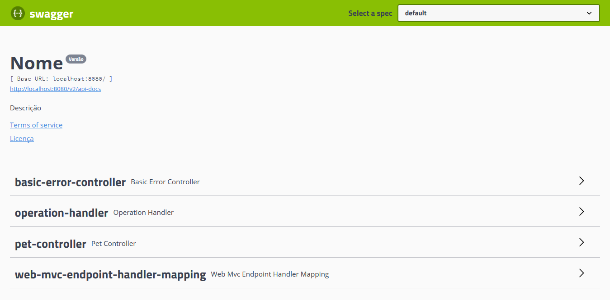
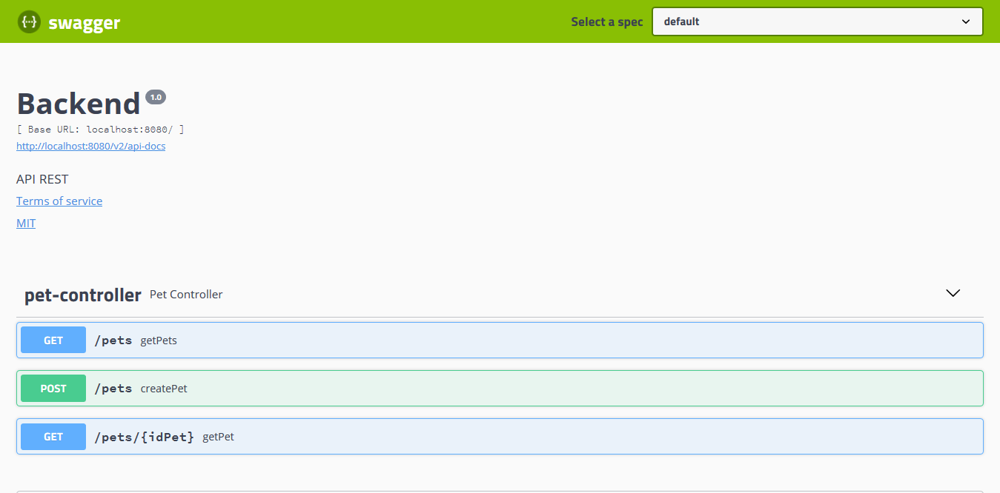

# Swagger (documentação de API)

O Swagger é uma biblioteca que permite a geração de um arquivo JSON que
representa uma API a partir do código fonte. Assim, a descrição dos
_endpoints_ pode ser feita a partir de anotações nos controladores e métodos.

Durante o desenvolvimento, o componente Swagger UI proporciona uma interface
para a interação com a API, permitindo a efetuação de consultas aos
_endpoints_ com muita facilidade.

## 1. Adição das dependências


Este tutorial presume que você já gerou um projeto Spring.
Caso não tenha, veja as páginas relevantes:
[Spring com Maven](spring-com-maven.md) ou
[Spring com Gradle](spring-com-gradle.md)


Para utilizar o Swagger, você deve adicionar duas dependências ao seu projeto.
Utilize o arquivo e formato adequado para a sua ferramenta de _build_:

### Gradle

Localize o arquivo `build.gradle` na raiz do seu projeto e adicione duas
linhas à seção `dependencies`, como mostrado:

~~~groovy
dependencies {
	compile('io.springfox:springfox-swagger2:2.9.2')
	compile('io.springfox:springfox-swagger-ui:2.9.2')
}
~~~

### Maven

Localize o arquivo `pom.xml` na raiz do seu projeto e adicione dois blocos à
seção `<dependencies>`, como mostrado:

~~~xml
<dependencies>
	<dependency>
	    <groupId>io.springfox</groupId>
	    <artifactId>springfox-swagger2</artifactId>
	    <version>2.9.2</version>
	</dependency>
	<dependency>
	    <groupId>io.springfox</groupId>
	    <artifactId>springfox-swagger-ui</artifactId>
	    <version>2.9.2</version>
	</dependency>
</dependencies>
~~~

## 2. Configuração do Spring

Uma configuração será necessária para instruir o Swagger a listar os
controladores do seu projeto. Seguindo boas práticas, crie um
pacote `config` contendo a seguinte classe:

~~~java
@Configuration
@EnableSwagger2
public class SwaggerConfig {
    @Bean
    public Docket apis() {
        return new Docket(DocumentationType.SWAGGER_2)
                .select()
                .apis(RequestHandlerSelectors.any())
                .paths(PathSelectors.any())
                .build()
                .apiInfo(apiInfo())
                .useDefaultResponseMessages(false);
    }

    private ApiInfo apiInfo() {
        return new ApiInfo(
                "Nome",
                "Descrição",
                "Versão",
                "Termos de serviço",
                null,
                "Licença",
                "URL da licença",
                new ArrayList<>()
        );
    }
}
~~~

Você modifique o método `apiInfo()` para alterar as informações mostradas.

## 3. Acesso à interface

Após executar a sua aplicação, a interface de interação com o Swagger UI deve
estar acessível na seguinte URL:

http://localhost:8080/swagger-ui.html

## 4. Limitando os controladores exibidos

Com a configuração mostrada acima, alguns controladores definidos pelo Spring
(`basic-error-controller`, `operation-handler`) são incluídos. Para mostrar
apenas os que você definir, modifique o método `apis()` da seguinte maneira,
alterando `"com.example"` para o qualificador do seu projeto.

~~~java
@Bean
public Docket apis() {
    return new Docket(DocumentationType.SWAGGER_2)
            .select()
            .apis(RequestHandlerSelectors.basePackage("com.example"))
            .paths(PathSelectors.any())
            .build()
            .apiInfo(apiInfo())
            .useDefaultResponseMessages(false);
}
~~~

