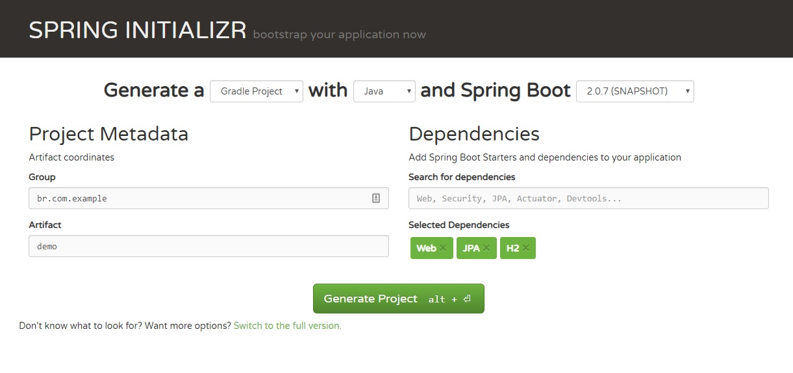

# Criando Entidades JPA com H2

Crie um projeto Gradle conforme a imagem abaixo



## **Criando a Entidade Usuário**

Crie um novo _package_ `model` dentro de `br.com.example.demo`

Crie uma classe `Usuario.java` dentro de `br.com.example.demo.model`



```java

package br.com.example.demo.model;

import javax.persistence.Entity;
import javax.persistence.GeneratedValue;
import javax.persistence.Id;
import javax.persistence.OneToOne;
import javax.validation.constraints.Email;
import javax.validation.constraints.NotNull;
import javax.validation.constraints.Size;

@Entity
public class Usuario {

    @Id
    @GeneratedValue
    private Long id;

    @OneToOne
    @NotNull
    @Size(min = 1, max = 120)
    private String nome;

    @NotNull
    @Email
    private String email;

    @NotNull
    private String senha;

    public Usuario() {
    }

    public Long getId() {
        return id;
    }

    public void setId(Long id) {
        this.id = id;
    }

    public String getNome() {
        return nome;
    }

    public void setNome(String nome) {
        this.nome = nome;
    }

    public String getEmail() {
        return email;
    }

    public void setEmail(String email) {
        this.email = email;
    }

    public String getSenha() {
        return senha;
    }

    public void setSenha(String senha) {
        this.senha = senha;
    }
}
```



## **Criando a interface UsuarioRepository**

Crie um novo _package_ `repository` dentro de `br.com.example.demo`

Crie uma interface `UsuarioRepository.java` dentro de `br.com.example.demo.repository`



```java
import br.com.example.demo.model.Usuario;
import org.springframework.data.repository.CrudRepository;
import org.springframework.stereotype.Repository;

@Repository
public interface UsuarioRepository extends CrudRepository<Usuario, Long> {

}
```



A _annotation_  `@Repository` indica que esta interface será injetada como repositório pelo Spring.

A interface `CrudRepository.java` já possui os métodos necessários para trabalharmos com as operações de Create, Update, Delete e Remove.

## Criando um Endpoint GET

Crie um novo _package_ `controller`dentro de `br.com.example.demo`

Crie uma classe `UsuarioController.java` dentro de `br.com.example.demo.controller`



```java
import br.com.example.demo.model.Usuario;
import br.com.example.demo.repository.UsuarioRepository;
import org.springframework.beans.factory.annotation.Autowired;
import org.springframework.web.bind.annotation.RestController;

import java.util.List;
import java.util.stream.Collectors;
import java.util.stream.StreamSupport;

@RestController
public class UsuarioController {

    @Autowired
    private UsuarioRepository repository;

    @GetMapping("/usuarios")
    public List<Usuario> buscarTodos() {
        Iterable<Usuario> todos = repository.findAll();
        return toList(todos);
    }

    public <E> List<E> toList(Iterable<E> iterable) {
        return StreamSupport.stream(iterable.spliterator(), false).collect(Collectors.toList());
    }

}
```



Você pode adicionar alguns usuários para testes utilizando o método

```java
repository.save(new Usuario());
```

Agora basta apenas rodar o método main da classe principal e digitar o endereço abaixo no navegador.

```text
http://localhost:8080/usuarios
```

## **POM**

Abaixo o arquivo `pom.xml` onde as dependência são exibidas.



```markup
<?xml version="1.0" encoding="UTF-8"?>
<project xmlns="http://maven.apache.org/POM/4.0.0" xmlns:xsi="http://www.w3.org/2001/XMLSchema-instance"
   xsi:schemaLocation="http://maven.apache.org/POM/4.0.0 http://maven.apache.org/xsd/maven-4.0.0.xsd">
   <modelVersion>4.0.0</modelVersion>

   <groupId>br.com.example</groupId>
   <artifactId>demomvn</artifactId>
   <version>0.0.1-SNAPSHOT</version>
   <packaging>jar</packaging>

   <name>demomvn</name>
   <description>Demo project for Spring Boot</description>

   <parent>
      <groupId>org.springframework.boot</groupId>
      <artifactId>spring-boot-starter-parent</artifactId>
      <version>2.0.7.BUILD-SNAPSHOT</version>
      <relativePath/> <!-- lookup parent from repository -->
   </parent>

   <properties>
      <project.build.sourceEncoding>UTF-8</project.build.sourceEncoding>
      <project.reporting.outputEncoding>UTF-8</project.reporting.outputEncoding>
      <java.version>1.8</java.version>
   </properties>

   <dependencies>
      <dependency>
         <groupId>org.springframework.boot</groupId>
         <artifactId>spring-boot-starter-data-jpa</artifactId>
      </dependency>
      <dependency>
         <groupId>org.springframework.boot</groupId>
         <artifactId>spring-boot-starter-web</artifactId>
      </dependency>

      <dependency>
         <groupId>com.h2database</groupId>
         <artifactId>h2</artifactId>
         <scope>runtime</scope>
      </dependency>
      <dependency>
         <groupId>org.springframework.boot</groupId>
         <artifactId>spring-boot-starter-test</artifactId>
         <scope>test</scope>
      </dependency>
   </dependencies>

   <build>
      <plugins>
         <plugin>
            <groupId>org.springframework.boot</groupId>
            <artifactId>spring-boot-maven-plugin</artifactId>
         </plugin>
      </plugins>
   </build>

   <repositories>
      <repository>
         <id>spring-snapshots</id>
         <name>Spring Snapshots</name>
         <url>https://repo.spring.io/snapshot</url>
         <snapshots>
            <enabled>true</enabled>
         </snapshots>
      </repository>
      <repository>
         <id>spring-milestones</id>
         <name>Spring Milestones</name>
         <url>https://repo.spring.io/milestone</url>
         <snapshots>
            <enabled>false</enabled>
         </snapshots>
      </repository>
   </repositories>

   <pluginRepositories>
      <pluginRepository>
         <id>spring-snapshots</id>
         <name>Spring Snapshots</name>
         <url>https://repo.spring.io/snapshot</url>
         <snapshots>
            <enabled>true</enabled>
         </snapshots>
      </pluginRepository>
      <pluginRepository>
         <id>spring-milestones</id>
         <name>Spring Milestones</name>
         <url>https://repo.spring.io/milestone</url>
         <snapshots>
            <enabled>false</enabled>
         </snapshots>
      </pluginRepository>
   </pluginRepositories>


</project>

```



## Build Gradle

As mesmas dependências exibidas com gradle



```groovy
buildscript {
	ext {
		springBootVersion = '2.0.7.BUILD-SNAPSHOT'
	}
	repositories {
		mavenCentral()
		maven { url "https://repo.spring.io/snapshot" }

		maven { url "https://repo.spring.io/milestone" }
	}
	dependencies {
		classpath("org.springframework.boot:spring-boot-gradle-plugin:${springBootVersion}")
	}
}

apply plugin: 'java'
apply plugin: 'eclipse'
apply plugin: 'org.springframework.boot'
apply plugin: 'io.spring.dependency-management'

group = 'br.com.example'
version = '0.0.1-SNAPSHOT'
sourceCompatibility = 1.8

repositories {
	mavenCentral()
	maven { url "https://repo.spring.io/snapshot" }
	maven { url "https://repo.spring.io/milestone" }
}


dependencies {
	implementation('org.springframework.boot:spring-boot-starter-data-jpa')
	implementation('org.springframework.boot:spring-boot-starter-web')
	runtimeOnly('com.h2database:h2')
	testImplementation('org.springframework.boot:spring-boot-starter-test')
}

```




