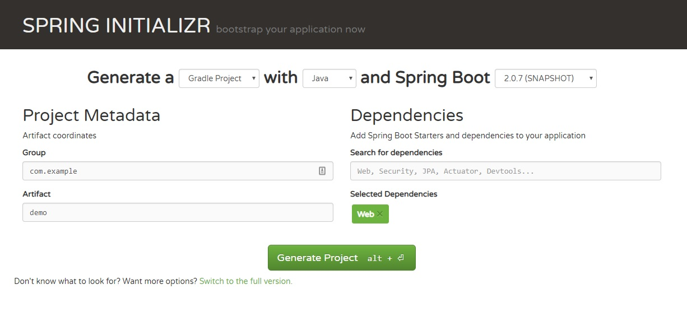
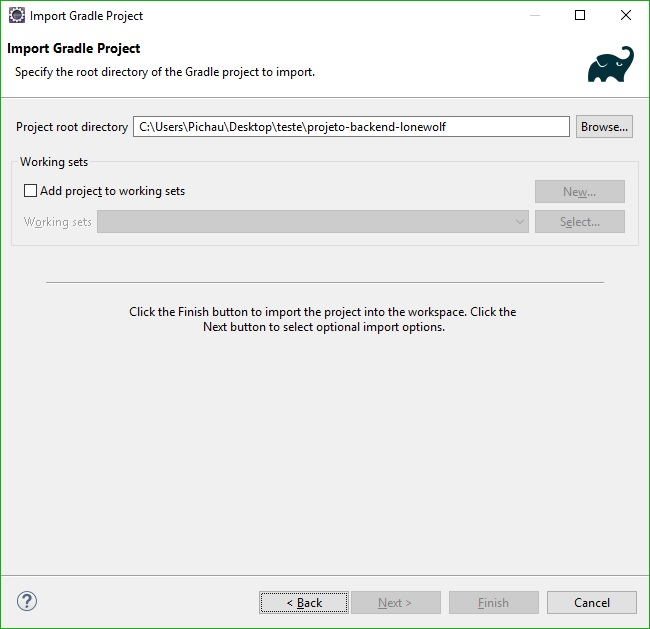

# Spring com Gradle

## Gerando um projeto Spring com Gradle

Acesse o site [start.spring.io](http://start.spring.io).

Selecione as opções conforme abaixo:

_Generate_ a `Gradle Project` with `Java` and Spring Boot `2.0.7 (SNAPSHOT)`

**Group** `com.example`  
**Artifact** `Demo`

**Dependencies**

* **Web**

Clique em **Generate Project.**

## **Importando o projeto no Eclipse**

**File -&gt; Import -&gt; Existing Gradle Projects**

Clique em **Finish.**

## **Importando o projeto no IntelliJIDEA**

**File -&gt; New -&gt; Project from Existing Sources -&gt; Selecione o diretório do arquivo** `build.gradle`

### Comandos

**Build**

> **gradle build**

**Iniciar Springboot**

> gradle bootRun

